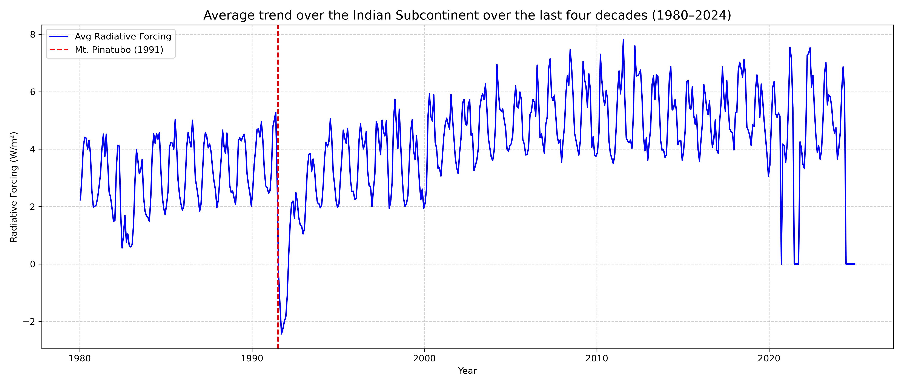
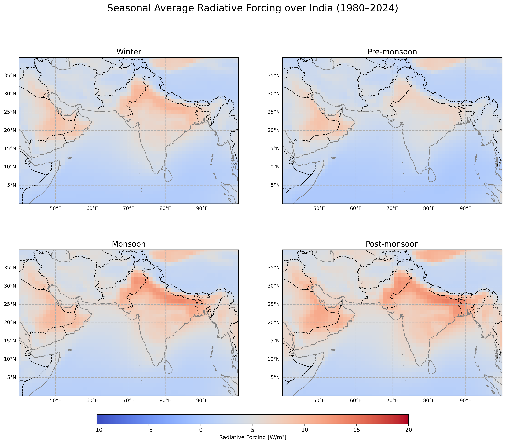
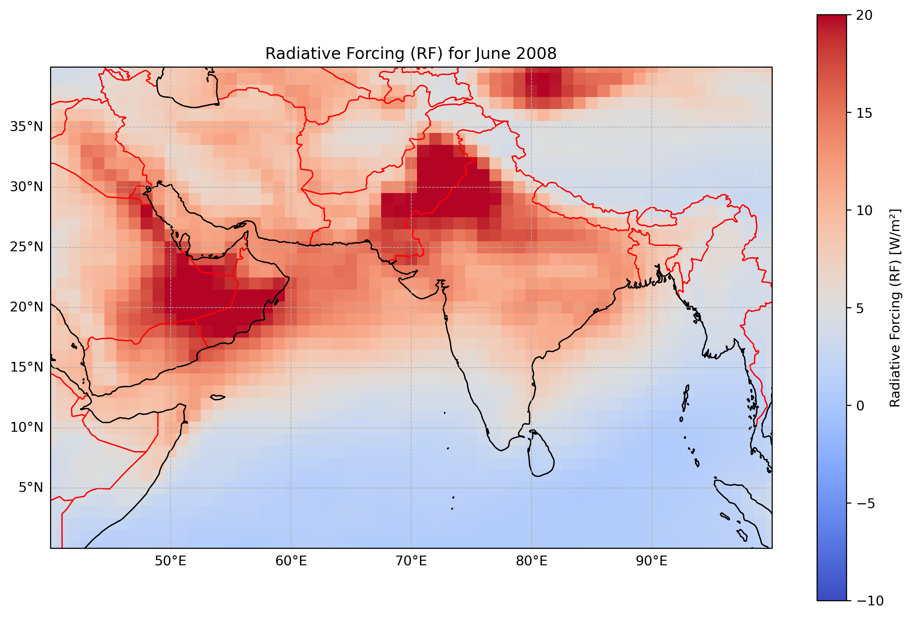
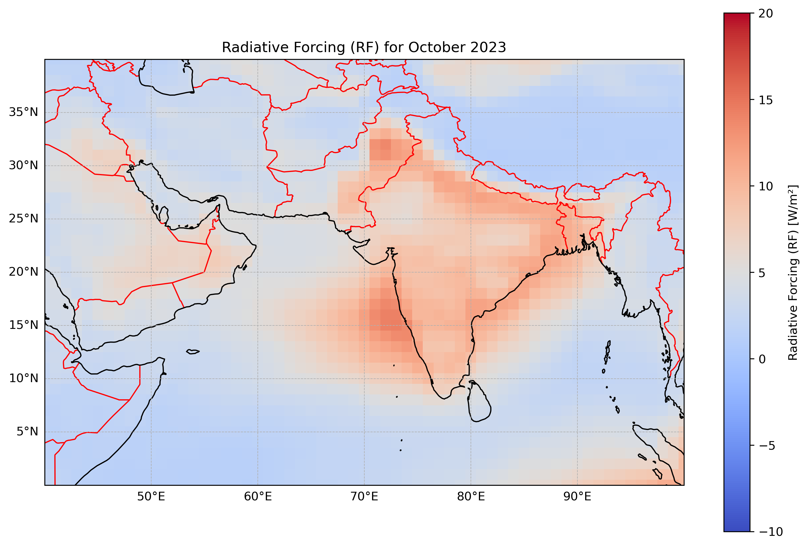

# India Aerosol Radiative Forcing Analysis

Python-based analysis of aerosol radiative forcing (ARF) over the Indian subcontinent (1980–2024) using NASA MERRA-2 atmospheric reanalysis data.

---

## Project Overview

This repository presents a comprehensive analysis of aerosol radiative forcing (ARF) over the Indian subcontinent using NASA's **Modern-Era Retrospective Analysis for Research and Applications, Version 2 (MERRA-2)** atmospheric reanalysis dataset.

The project investigates the spatial and temporal variability of aerosol radiative forcing from **January 1980 to December 2024** through geospatial mapping, seasonal averaging, and long-term time-series analysis. The analysis was carried out using Python and forms part of my **M.Sc. Physics research project**.

---

## Objectives

- Compute aerosol radiative forcing over the Indian subcontinent.
- Analyze long-term radiative forcing variability from 1980–2024.
- Generate monthly geospatial radiative forcing maps.
- Compute seasonal average radiative forcing.
- Produce long-term RF time-series over India.
- Visualize spatial and temporal aerosol forcing patterns using scientific Python tools.

---

## Dataset

**Dataset**

NASA MERRA-2 (Modern-Era Retrospective Analysis for Research and Applications, Version 2)

**Data Source**

NASA GES DISC

https://disc.gsfc.nasa.gov/

NASA’s Giovanni platform

https://giovanni.gsfc.nasa.gov/giovanni/


**Study Region**

- Latitude: **0°N – 40°N**
- Longitude: **40°E – 100°E**

**Study Period**

January 1980 – December 2024

---

## Variables Used

### Surface Flux Variables

- **SWGNTCLR** – Surface net downward shortwave flux (clear sky)
- **SWGNTCLRCLN** – Surface net downward shortwave flux (clear sky, no aerosol)
- **LWGNTCLR** – Surface net downward longwave flux (clear sky)
- **LWGNTCLRCLN** – Surface net downward longwave flux (clear sky, no aerosol)

### Top of Atmosphere (TOA) Flux Variables

- **SWTNTCLR** – TOA net downward shortwave flux (clear sky)
- **SWTNTCLRCLN** – TOA net downward shortwave flux (clear sky, no aerosol)
- **LWTUPCLR** – TOA upwelling longwave flux (clear sky)
- **LWTUPCLRCLN** – TOA upwelling longwave flux (clear sky, no aerosol)

## Radiative Forcing Equations

SOA = (SWGNTCLR + LWGNTCLR) − (SWGNTCLRCLN + LWGNTCLRCLN)

TOA = (SWTNTCLR + LWTUPCLR) − (SWTNTCLRCLN + LWTUPCLRCLN)

ATM = TOA − SOA

These irradiance variables were used to estimate radiative forcing at the surface of the atmosphere (SOA), top of the atmosphere (TOA), and atmospheric layer (ATM).

These variables were used to calculate Aerosol Radiative Forcing (ARF)


---

## Methodology

The overall workflow is illustrated below:

```
NASA MERRA-2 Data
        │
        ▼
Extract Required Variables
        │
        ▼
Compute Aerosol Radiative Forcing
        │
        ▼
Generate Monthly RF Matrices
        │
        ▼
Geospatial Mapping
        │
        ▼
Seasonal Average Analysis
        │
        ▼
Time-Series Analysis
        │
        ▼
Scientific Interpretation
```

---

## Repository Structure

```
India-Aerosol-Radiative-Forcing-Analysis/

├── README.md
├── requirements.txt
│
├── src/
│   ├── geospatial_mapping.py
│   ├── seasonal_average_analysis.py
│   └── timeseries_analysis.py
│
├── data/
│   └── DATASET_INFORMATION.md
│
└── figures/
    ├── RF_Timeseries_1980_2024.png
    ├── Representative_RF_Map_June_2008.png
    ├── Representative_RF_Map_October_2023.png
    └── Seasonal_RF_Combined_Labeled.png
```

---

## Python Libraries Used

- NumPy
- Matplotlib
- Cartopy
- NetCDF4
- SciPy

---

## Analysis Performed

### 1. Geospatial Mapping

Generated monthly spatial maps of aerosol radiative forcing over the Indian subcontinent for the period **1980–2024**. The maps illustrate the geographical distribution of aerosol radiative forcing and help identify regional variations across different climatic zones.

---

### 2. Seasonal Average Analysis

Computed seasonal mean aerosol radiative forcing for the four climatological seasons:

- Winter (DJF)
- Pre-Monsoon (MAM)
- Monsoon (JJAS)
- Post-Monsoon (ON)

The seasonal averages are presented as a **single four-panel figure**, enabling comparison of aerosol radiative forcing patterns across seasons.

---

### 3. Time-Series Analysis

Calculated the spatially averaged aerosol radiative forcing over the Indian subcontinent and generated a continuous monthly time-series from **1980–2024** to examine long-term temporal variability.

---

# Results

## Long-Term Radiative Forcing Time Series (1980–2024)

The figure below shows the spatially averaged aerosol radiative forcing over the Indian subcontinent from January 1980 to December 2024.



---

## Seasonal Average Radiative Forcing

The figure below presents the seasonal mean aerosol radiative forcing over India for all four climatological seasons in a single panel.



---

## Representative Geospatial Radiative Forcing Map

This project generates monthly geospatial aerosol radiative forcing maps for the period **1980–2024** (540 monthly maps). Due to the large number of outputs, only two representative map is included in this repository. All maps can be regenerated using the Python scripts provided in the `src` directory.






---

## How to Run

Clone the repository

```bash
git clone https://github.com/yourusername/India-Aerosol-Radiative-Forcing-Analysis.git
```

Install the required Python packages

```bash
pip install -r requirements.txt
```

Run the analysis scripts

```bash
python src/geospatial_mapping.py

python src/seasonal_average_analysis.py

python src/timeseries_analysis.py
```

---

## Future Work

- Mann–Kendall trend analysis
- Machine learning-based aerosol radiative forcing prediction
- Interactive climate visualization dashboard
- Extension to global aerosol radiative forcing analysis

---

## Author

**Anugraha Abraham**

M.Sc. Physics

Incoming M.Sc. Data Science Student (2026)

**Research Interests**

- Climate Data Analysis
- Remote Sensing
- Scientific Computing
- Machine Learning
- Data Visualization

---

## Acknowledgements

- NASA Global Modeling and Assimilation Office (GMAO)
- NASA GES DISC's Giovanni Platform for providing the MERRA-2 atmospheric reanalysis dataset.
